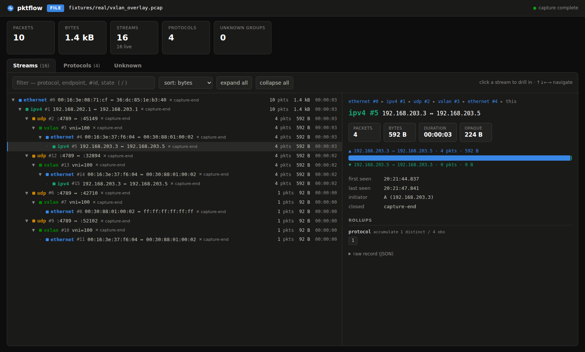
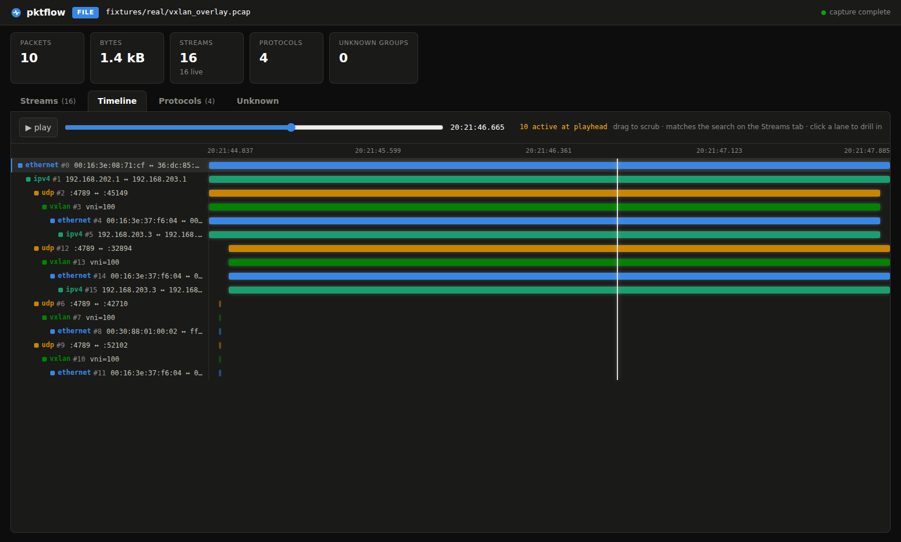
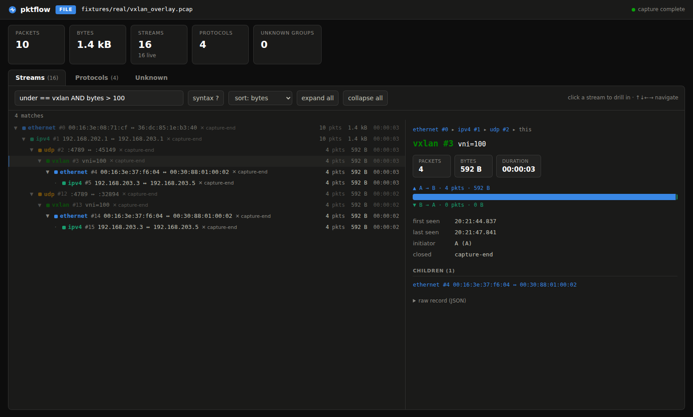
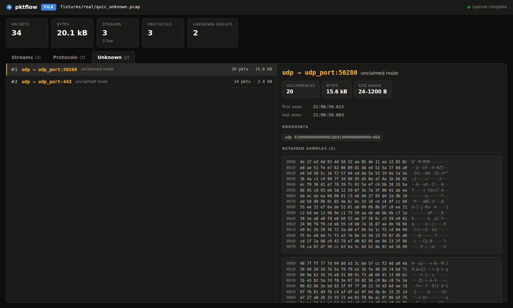

# pktflow

A plugin-extensible Rust engine that dissects captured network traffic and aggregates it
into a browsable hierarchy of conversations and streams — MAC conversations, IP
conversations, TCP/UDP sessions, and application-level streams each
carrying rolled-up metadata over its lifetime.

A packet in isolation is noise. The signal is that two endpoints have an ongoing session,
riding inside their IP conversation, riding on a MAC conversation, and over its lifetime it
has exchanged N packets, this much data, this metadata. pktflow's job is producing that
picture, not just decoding bytes. See [`PRD.md`](PRD.md) for the full product rationale and
[`specs/`](specs/) for the design-by-task breakdown this codebase was built against.

## Highlights

- **Protocol plugins are self-contained.** The engine holds no protocol knowledge; each
  plugin declares how it's routed to, parses its own header, and (optionally) declares the
  stream identity and rollups it contributes. Adding a protocol is one new file plus one
  registration line — see [`docs/adding-a-protocol.md`](docs/adding-a-protocol.md).
- **Streams nest by construction.** A tunnel's inner conversation becomes a child of the
  outer one purely from per-packet layer order — no protocol-specific tunnel handling
  anywhere in the aggregator.
- **Depth is a caller-set knob.** Ask for just flow-key fields (`--depth keys`) and skip the
  cost of full field extraction, or ask for everything (`--depth full`).
- **No phantom streams.** Unclaimed/encrypted payloads land as opaque bytes on their
  innermost recognized parent, never a fabricated child stream.
- **Unknown traffic is a first-class lens, not a grep exercise.** `pktflow unknown` groups
  everything no plugin claimed or no heuristic was confident about, ranked with near-miss
  scores and real sample bytes — with `--export` and `--scaffold` as the on-ramp to writing
  the plugin that's missing. See [`docs/unknown-diagnostics.md`](docs/unknown-diagnostics.md).
- **One query language across every surface.** The TUI filter box, the web UI search
  bar, and `pktflow streams --where` all speak the same expression language — free
  text, `/regex/`, and field comparisons with AND/OR/NOT (`proto == dns AND bytes > 10k`,
  `under == vxlan`, `qname =~ /google/`). See [`docs/query-language.md`](docs/query-language.md).
- **Two first-class front-ends beyond the CLI.** `pktflow tui` opens a full-screen
  terminal browser (ratatui) over the stream hierarchy — fold/unfold subtrees, drill into
  any stream's rollups, triage unknowns — and `pktflow serve` embeds a zero-dependency
  web UI + JSON API + SSE live events in the binary. Both include a **timeline view**:
  per-stream lifetime lanes with a scrubbable/playable playhead, so temporal causality
  (the DNS lookup firing just before the TCP session opens) is visible at a glance.
  Both work offline and live. See [`docs/tui-and-web.md`](docs/tui-and-web.md).
- 62 reference protocol plugins today, spanning link (Ethernet, 802.1Q VLAN, LLDP, LACP,
  STP), network (ARP, IPv4, IPv6, ICMP, IGMP, OSPF, BGP), transport (TCP, UDP, SCTP),
  tunnels and overlays (GRE, VXLAN, Geneve, MPLS, ERSPAN, GTP-U, IPsec, WireGuard, L2TPv3,
  PPPoE/PPP), data-center control and fabric planes (BFD, VRRP, HSRP, RoCEv2, PTP),
  applications (DNS, DHCP, NTP, HTTP, TLS, SNMP, syslog), name/service discovery (mDNS,
  LLMNR, SSDP, NetBIOS-NS), Wi-Fi (radiotap, 802.11), and industrial/IoT (Modbus, DNP3,
  MQTT, BACnet/IP).

## Screenshots

The embedded web UI (`pktflow serve`) drilling into a nested VXLAN overlay — the inner
conversation's full lineage, direction split, and rollups:



The Timeline tab, scrubbed to mid-capture: crossed lanes are active, passed lanes dim,
short-lived broadcast flows show as slivers near the start:



| Query search (`under == vxlan AND bytes > 100`) | Unknown-traffic triage (QUIC as unclaimed `udp:443`) |
|---|---|
|  |  |

The TUI (`pktflow tui`) offers the same lenses — tree, timeline, unknown triage,
summary — in the terminal.


## Quick start

```sh
cargo build --release
./target/release/pktflow capture.pcap                  # shorthand for `pktflow streams -r capture.pcap`
./target/release/pktflow streams -r capture.pcap --batch --format json  # one JSON document, for scripting
./target/release/pktflow stream -r capture.pcap '#3'      # drill into one stream (by id from a streams view)
./target/release/pktflow packets -r capture.pcap -v       # per-packet debug lens
./target/release/pktflow unknown -r capture.pcap          # triage unclaimed/unrecognized traffic
./target/release/pktflow tui -r capture.pcap              # interactive terminal UI (browse + drill down)
./target/release/pktflow serve -r capture.pcap            # web UI + JSON API on http://127.0.0.1:8320/
./target/release/pktflow streams -r capture.pcap --batch --where 'proto == tcp AND bytes > 1M'
./target/release/pktflow ifaces                           # list capturable interfaces
sudo ./target/release/pktflow streams -i eth0             # live, full-screen view (the default)
```

`streams` defaults to a live, continuously-redrawn view (full-screen text, or an NDJSON
event stream for `--format json`) — pass `--batch` to run once and print a single final
result instead, which is what you want for scripting (`--format json --batch` gives one
parseable document rather than a stream of events). Run `pktflow <subcommand> --help` for
the full flag set (BPF filters, live-mode eviction tuning, `--entry` for forced first-layer
dissection, and more).

## Workspace layout

| Crate | Role |
|---|---|
| `pktflow-core` | Values, layers, the plugin trait, router, lazy parser — protocol-free |
| `pktflow-plugins` | The reference protocol set and its registration list |
| `pktflow-flows` | The stream aggregator: store, hierarchy, rollups, lifecycle, queries |
| `pktflow-capture` | The only crate touching libpcap/Npcap — offline files, live devices |
| `pktflow-view` | Shared presentation layer: value/endpoint formatting, JSON records, snapshot hub |
| `pktflow-tui` | The `pktflow tui` terminal UI (ratatui): tree browser, drill-down, unknown triage |
| `pktflow-web` | The `pktflow serve` web UI: axum JSON API, SSE live events, embedded SPA |
| `pktflow-cli` | The `pktflow` binary: streams view, drill-down, packet mode, JSON output |
| `pktflow-testkit` | Synthetic wire-format packet/capture builders shared by tests |

Crate boundaries are enforced mechanically (`scripts/check-boundaries.sh`, part of `just
ci`): `pktflow-core`/`pktflow-flows` never touch pcap, and `pktflow-flows` never depends on
`pktflow-plugins` — the aggregator has no protocol knowledge.

## Development

This repo uses [`just`](https://github.com/casey/just) as its task runner.

```sh
just ci      # fmt --check, clippy -D warnings, boundary check, cargo test --workspace
just bench   # the five criterion benches (throughput, depth payoff, memory) — see benches/README.md
just fuzz    # local fuzz smoke (nightly + cargo-fuzz required) — same targets as the scheduled CI job
```

`just ci` is what the GitHub Actions `lint`/`boundaries`/`test` jobs run per PR/push. Fuzzing
and benchmarks are scheduled jobs, not per-PR gates — see `.github/workflows/fuzz.yml` and
`.github/workflows/bench.yml`.

A `Dockerfile` is also provided: it builds the workspace and runs the full test suite
(`cargo test --workspace --all-features -- --include-ignored`) inside a container, which
gets `CAP_NET_RAW` by default — that's enough to run the three `#[ignore]`d live-capture
tests in `crates/pktflow-capture/tests/live.rs` that a bare CI runner can't. Wired into the
`privileged-integration-tests` job in `.github/workflows/ci.yml`.

```sh
docker build -t pktflow-test .
docker run --rm pktflow-test
```

## Project status

Built task-by-task against the specs in [`specs/`](specs/); each sub-task's acceptance
criteria are tracked as checkboxes in its own file. See `specs/README.md`/`specs/*/README.md`
for the current breakdown, and [`specs/CONSTITUTION.md`](specs/CONSTITUTION.md) for the rules
governing how specs and code stay in sync.

## License

MIT — see [`LICENSE`](LICENSE).
